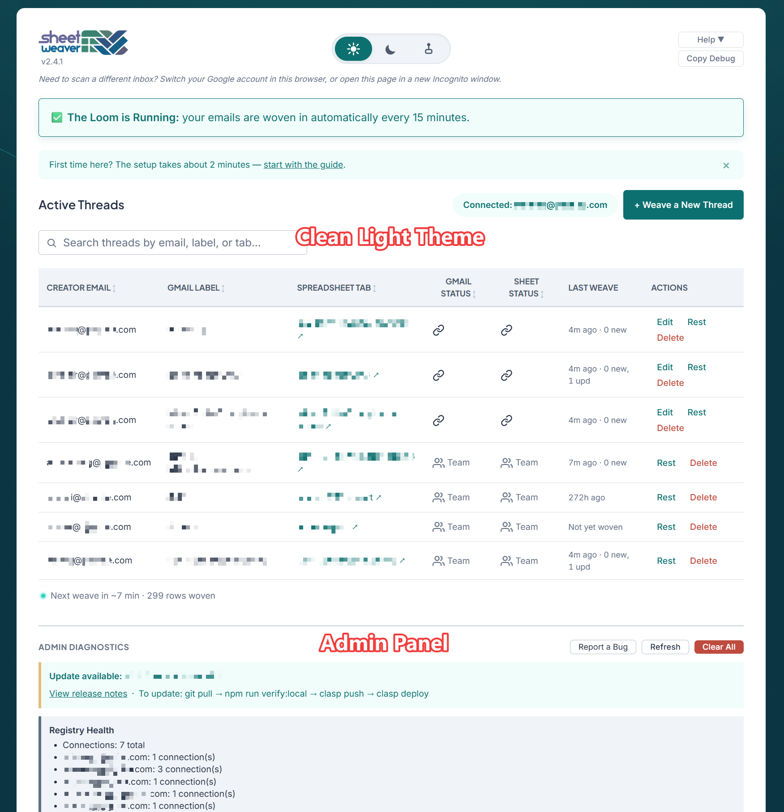
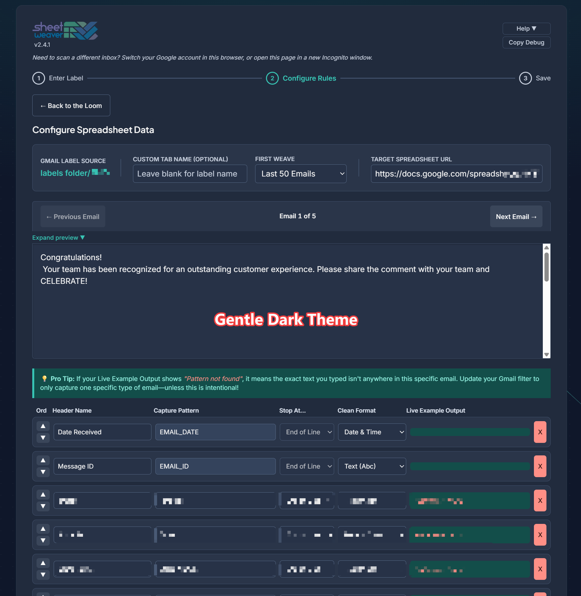
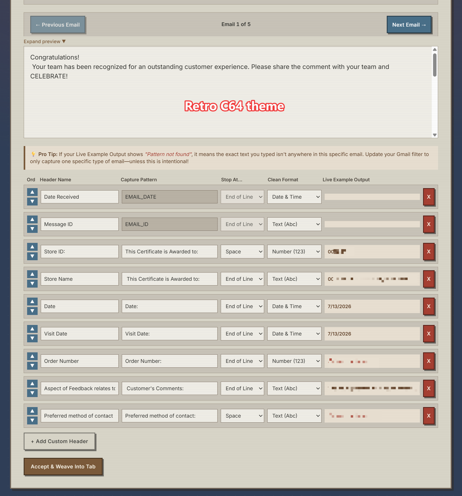

<p align="center">
  
</p>

SheetWeaver is a Google Apps Script web app that automatically extracts structured data from Gmail labels into Google Sheets, running on a 15-minute schedule with no manual intervention required.

## What It Does

Users connect a Gmail label to a Google Sheet tab and define extraction rules (field names and patterns). The app then scans matching emails on a recurring trigger and writes parsed data — sender, date, subject, and custom-extracted fields — into rows on the configured sheet.

Multiple team members can each configure their own threads. Each user's trigger runs as themselves, reading their own Gmail and writing to their own permitted Sheets.

## Screenshots

Click any image for the full-size version. See [Themes](#themes) for how the palettes are selected.

<table>
  <tr>
    <td align="center" width="33%">
      <a href="docs/screenshots/light-homepage.png">
        
      </a>
      <br><sub><b>Solar</b> — dashboard and admin diagnostics</sub>
    </td>
    <td align="center" width="33%">
      <a href="docs/screenshots/dark-parser-ui.png">
        
      </a>
      <br><sub><b>Torres</b> — parser rules, wizard step 2</sub>
    </td>
    <td align="center" width="33%">
      <a href="docs/screenshots/c64-parser-ui.png">
        
      </a>
      <br><sub><b>C64</b> — parser rules, wizard step 2</sub>
    </td>
  </tr>
</table>

## Tech Stack

| Layer | Technology |
|-------|-----------|
| Runtime | Google Apps Script (V8) |
| Frontend | Vanilla HTML/CSS/JS served via `HtmlService` |
| Email | `GmailApp` (read-only label queries) |
| Storage | `SpreadsheetApp` + `PropertiesService` |
| Scheduling | `ScriptApp` time-based triggers (every 15 min) |
| Deploy CLI | `@google/clasp` |

## Prerequisites

- A Google account (consumer `@gmail.com` or Google Workspace both work)
- Node.js 18 or later
- `clasp` CLI authenticated with your Google account

Full install commands: [Setup Guide — Prerequisites](docs/setup-guide.md#prerequisites).

## Install Checklist

Each installer creates their own Apps Script project and becomes the admin for that instance. Full commands are in the [Setup Guide](docs/setup-guide.md).

- [ ] Clone the repo and install dependencies
- [ ] Create a new Apps Script project with your own `scriptId`
- [ ] Push code and run `bootstrapAdmin` once to register yourself as admin
- [ ] Deploy as a web app
- [ ] Choose your access level (`ANYONE` or `DOMAIN`-restricted)
- [ ] Open the web app, click **+ Weave a New Thread**, and enter your Sheet URL to complete your first thread
- [ ] Optionally set an org-wide default Sheet URL
- [ ] Share the web app URL with your team

## Setup

See **[docs/setup-guide.md](docs/setup-guide.md)** for full step-by-step instructions, including:

- Brand-new Apps Script project via `clasp` (primary path)
- Linking to an existing Apps Script project
- Manual copy-paste install (no `clasp` required)
- Update instructions for future pushes

## Configuration

### appsscript.json

| Setting | Value | Meaning |
|---------|-------|---------|
| `executeAs` | `USER_ACCESSING` | Each visitor's session runs as themselves |
| `access` | `ANYONE` | Any signed-in Google account can use the app |
| `timeZone` | `America/Los_Angeles` | Trigger scheduling reference |
| `exceptionLogging` | `STACKDRIVER` | Errors appear in Cloud Logging |

**Workspace-only variant:** restricting access to your Google Workspace domain is a one-line manifest change — see [Setup Guide §8](docs/setup-guide.md#8-optional-workspace-only-access).

**Personal install variant (single-user only):** if you want only yourself to use the app, you must set **both** of the following in the Apps Script deploy dialog — changing only one is unsafe:
- **Execute as:** Me (the deployer) — i.e. `executeAs: USER_DEPLOYING`
- **Who has access:** Only myself — i.e. `access: MYSELF`

> **Warning:** setting `executeAs: USER_DEPLOYING` while leaving `access: ANYONE` is unsafe — any signed-in Google user who has the URL can open the app and trigger backend operations that run as you. This variant is **single-user only** and disables the team model; use the default `USER_ACCESSING` settings for shared installs. *(Note: this personal-install path has not been end-to-end tested — use with caution.)*

### Default Spreadsheet URL

Users enter their own Sheet URL during setup by default. Admins can optionally set an org-wide default — see [Setup Guide — Optional: Org-Wide Default Sheet URL](docs/setup-guide.md#optional-org-wide-default-sheet-url).

## Project Structure

```
├── Code.js              # All backend logic
├── Index.html           # Full frontend — UI, themes, step wizard
├── appsscript.json      # Apps Script manifest
├── .clasp.json.example  # Template — copy to .clasp.json and fill in your scriptId
├── package.json         # Dev tooling (clasp + local verify)
├── scripts/
│   └── local-verify.js  # Local gate — run before every push
├── docs/
│   ├── ARCHITECTURE.md          # How frontend, backend, and storage fit together
│   ├── setup-guide.md           # Full install and update instructions
│   ├── first-time-user-flow.md  # End-user walkthrough (linked from the in-app Help menu)
│   ├── troubleshooting.md
│   └── qa-runbook.md            # Post-deploy test matrix
└── .github/
    └── workflows/
        └── deploy.yml   # Manual-only CI deploy (project-specific — see file header)
```

## Usage Flow

1. Open the web app URL — you see the dashboard listing all your active threads.
2. Click **+ Weave a New Thread** and enter a Gmail label name. The app verifies the label and scans recent emails to suggest field names.
3. Define column headers and optional extraction patterns (regex or keyword delimiters).
4. Save — the app registers the thread and automatically starts your 15-minute weave trigger.
5. Emails arriving under the label are processed automatically every 15 minutes.

First-time visitors see a dismissible welcome tip on the dashboard. The header shows the running app version (e.g. `v2.4.0`) and a **Help** menu linking to the Troubleshooting Guide, Setup Guide, [First-Time User Guide](docs/first-time-user-flow.md), Changelog, and a Report-a-Bug shortcut. Below the threads table, a status line shows the countdown to the next weave and a lifetime rows-woven count.

## Themes

The UI ships with three CSS themes selectable per-user:

| Theme | Style |
|-------|-------|
| `solar` | Light / warm tones |
| `torres` | Dark / muted |
| `nes` | Retro Commodore 64 palette |

Theme choice is persisted per-user via `PropertiesService`.

All themes share a subtle ambient background: faint threads continuously weave between dots of the background grid, and arriving at the dashboard from the wizard plays a one-time dot-glow wave. Both animations are decorative — they never intercept clicks and are disabled automatically when the OS "reduce motion" setting is on.

## Known Limitations

- Each connection is stored in its own Script Property (capped at ~9 KB per connection), and the overall Script Properties store is capped at ~500 KB across all users. Monitor both in the Admin Diagnostics panel.
- Consumer Gmail accounts operating under `ANYONE_WITH_GOOGLE` may see an empty identity in rare multi-account browser sessions. The app shows a clear error with a report ID when this happens.

Remediation history is internal and not included in this repository.

## Logs & Debugging

Every failure produces a **report ID** visible to the user in the app and to the admin in:

- **In-app Admin Diagnostics panel** (admin-only section of the dashboard)
- **Apps Script editor → Executions** (per-run view; search for the report ID)
- **Google Cloud Console → Logging** (full log search via `[DIAG]` prefix)

Non-admins see only the report ID in their error message. Admins can look up the full structured log by that ID.

### Copy Debug

The header bar has a **Copy Debug** button on every screen — click it and paste the output into a support message when something goes wrong. Full explanation: [Troubleshooting Guide](docs/troubleshooting.md).
